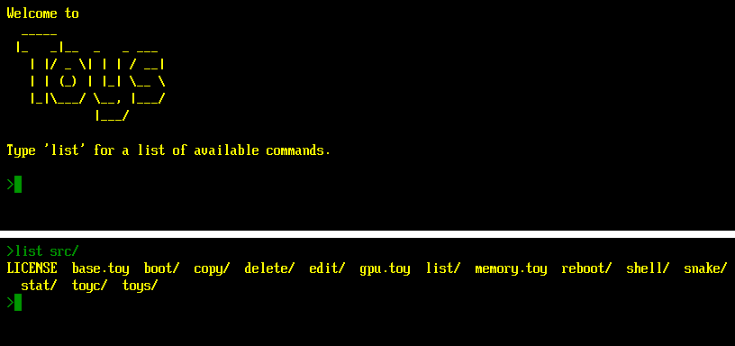

# Toys

A toy, **monotasking**, **self-hosted** operating system in less than
**3300 lines** of code. Includes:

- a **boot loader** (~100 lines),
- a monolithic **kernel** (~1030 lines),
- a **shell** (~230 lines),
- a text editor (~220 lines),
- a **compiler** for a toy, statically-typed language called Toy (~1300 lines).

Toys runs in **192KB of RAM** and uses less than **192KB of disk**, in a 1MB
partition (this includes 48KB of compiled code, and 106KB of source code). The
compressed bootable
[disk image](https://github.com/ebruneton/toys/releases/download/v1.0/toys-1.0-amd64.img.gz)
fits in 64KB. This is a port to x86_64 of the
[original version](https://github.com/ebruneton/toypc), which was written for an
ARM-v7M micro-controller.

## Running

Toys can be run in [QEMU](https://www.qemu.org/) or on real hardware. Once it is
running, you can try the following commands:

- `list`, `list src/`, etc to list the content of a "directory"
- `snake` to play a simple
  [snake game](https://en.wikipedia.org/wiki/Snake_(video_game_genre)) (type ESC
  to exit)
- `edit src/snake/snake.toy` to look at its source code (type ESC to exit)
- `shell src/snake/BUILD` to recompile this program
- `shell src/toyc/BUILD` to recompile the Toy compiler with itself
- `shell src/toys/BUILD` to recompile the Toys kernel
- `reboot` to restart with the recompiled kernel
- ...

### In QEMU

#### Prerequisites

- gcc
- make
- qemu-system-x86_64

On Ubuntu, the latter can be installed with `sudo apt-get install qemu-system`.

#### Running

Type `make` to compile and run Toys from source code.

### On real hardware

#### Prerequisites

A computer with a 64 bits Intel or AMD processor, and UEFI support.

*Warning*: Toys has only been tested on a single personal computer (a 10 years
old Gigabyte H110M-S2HP-CF with Intel Core i5 6500), it might not work on yours.
In particular, Toys requires a 100x31 console mode.

#### Running

- Download and uncompress the Toys bootable
  [disk image](https://github.com/ebruneton/toys/releases/download/v1.0/toys-1.0-amd64.img.gz),
  or build one from source code with `make image` (requires gcc and make; the
  result is in `bin/toys-1.0-amd64.img`).
- Flash this disk image on an USB stick. On Ubuntu, this can be done with
  [`gnome-disks --restore-disk-image`](https://manpages.ubuntu.com/manpages/focal/man1/gnome-disks.1.html).
- Reboot your computer and boot from the USB stick (you might need to disable
  Secure Boot in your UEFI settings).

## Goals

- simple
- minimal
- readable
- self-hosted

## Non-Goals

- useful
- efficient
- portable

## Features

- text only (no GUI)
- keyboard input only (no mouse support)
- extremely basic, non-hierarchical file system
- monotasking: parent process suspended until a child process terminates
- single address space, identity mapped, shared between kernel and processes
- process isolation via memory page attributes and privilege levels
- basic exception handling: current process killed, parent resumed
- kernel isolation via system calls (open, read, write, close, etc)
- UEFI-based

## Roadmap

There is no plan to develop Toys any futher, and in particular to add new
features. On the contrary, some features might be removed to make Toys even
smaller and simpler (but still self-hosted, with a "high-level" and "readable"
language -- i.e., excluding assembly and concatenative languages).

## Project Layout

- bin: the build results
- doc: [documentation](doc/toys.md)
- src: the Toy source code of all the components of Toys
  - boot loader
  - kernel
  - shell
  - text editor
  - Toy compiler (toyc)
  - command line tools (copy, delete, list, etc)
- test: automated tests to verify the self-hosting property of toyc and Toys
- tools: the tools to build a Toys bootable disk image
  - toyc: the Toy compiler ported to ANSI C
  - makefatfs: creates a Toys file system image containing all the source
    and compiled code of Toys
  - makebootefi: wraps the boot loader in an UEFI
    [PE32+](https://en.wikipedia.org/wiki/Portable_Executable) executable
  - makefatfs: creates a
    [FAT12](https://en.wikipedia.org/wiki/File_Allocation_Table#FAT12) partition
    image containing the boot loader and the Toys file system image
  - maketoysimg: creates the disk image by wrapping the FAT12 partition in a
    [GUID partition table](https://en.wikipedia.org/wiki/GUID_Partition_Table)

## License

This project is licensed under the GNU GPLv3 - see the [LICENSE](LICENSE) file
for details.
