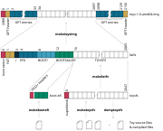

# Toys

**Contents**

- [Programming language](#programming-language)
- [UEFI library](#uefi-library)
- [File system](#file-system)
- [Boot loader](#boot-loader)
- [Drivers](#drivers)
- [Processes and system calls](#processes-and-system-calls)
- [Process isolation](#process-isolation)
- [Kernel initialization](#kernel-initialization)
- [Disk image](#disk-image)

Toys is a **monotasking**, **self-hosted** operating system in less than
**3300 lines** of code. The original version, for ARM-v7M, is presented in full
details in [Part 3](https://ebruneton.github.io/toypc/toypc.pdf#page=189) of
[[1]](#toypc). This page only describes the main differences between the
original version and the x86_64 port.

The x86_64 version is based on [UEFI](https://en.wikipedia.org/wiki/UEFI):

- The boot loader uses the UEFI protocols to locate the kernel, to allocate
  memory for it, and to read it from disk.
- The kernel implements its drivers (timer, keyboard, screen, disk) as thin
  wrappers on top of the UEFI protocols
  ([SimpleTextInput](https://uefi.org/specs/UEFI/2.9_A/12_Protocols_Console_Support.html#simple-text-input-protocol),
  [SimpleTextOutput](https://uefi.org/specs/UEFI/2.9_A/12_Protocols_Console_Support.html#simple-text-output-protocol),
  [BlockIO](https://uefi.org/specs/UEFI/2.9_A/13_Protocols_Media_Access.html#block-i-o-protocol),
  etc).

The second point is possible because Toys never calls
[ExitBootServices()](https://uefi.org/specs/UEFI/2.9_A/07_Services_Boot_Services.html#efi-boot-services-exitbootservices).
Still, like a normal OS on x86_64, and as described below, it:

- sets up Global Descriptor Table entries, Interrupt Table entries, and Task
  State Segments,
- executes applications in unprivileged mode (ring 3),
- uses `syscall` and `sysret` for system calls,
- and uses paging to isolate processes.

<a name="toypc">[1]</a>
[Programming a toy computer from scratch](https://ebruneton.github.io/toypc/toypc.pdf),
Eric Bruneton, 2024

## Programming language

Toys is implemented in a toy language called Toy, with its own compiler also
written in Toy. The language and the compiler are almost the same in the
original version and in the x86_64 port. The main language difference is the
replacement of `u32` with `u64`, due to the change from a 32 bits to a 64 bits
architecture. The main differences in the compiler are in its backend part, and
are described in a [separate page](toyc.md) (which also gives an overview of the
Toy language).

## UEFI library

One of the first difference between the x86_64 and the ARM-v7M versions of Toys
is the addition of a small UEFI library, in [src/boot/uefi/](../src/boot/uefi).
It is used in the boot loader and in the kernel to locate and call various UEFI
services. This library is divided in two parts: API and implementation.

### API

The [boot/uefi/api.toy](../src/boot/uefi/api.toy) file defines Toy structs
corresponding to the UEFI data structures used in Toys:
[SystemTable](https://uefi.org/specs/UEFI/2.11/04_EFI_System_Table.html#efi-system-table-1),
[SimpleTextInputProtocol](https://uefi.org/specs/UEFI/2.11/12_Protocols_Console_Support.html#efi-simple-text-input-protocol),
[SimpleTextOutputProtocol](https://uefi.org/specs/UEFI/2.11/12_Protocols_Console_Support.html#simple-text-output-protocol),
and
[BlockIoProtocol](https://uefi.org/specs/UEFI/2.11/13_Protocols_Media_Access.html#block-i-o-protocol).
The UEFI data structures contain fields defining individual services, such as
the ReadKeyStroke field in SimpleTextInputProtocol. These fields have
[function pointer](https://en.wikipedia.org/wiki/Function_pointer) types
defining the precise parameter and return types of each service. Unfortunately
Toy does not have function pointer types. Therefore, in Toy, these fields are
declared with a generic type, namely `&Fn` (a pointer to an empty struct called
`Fn`). For instance, in Toy, SimpleTextInputProtocol is defined as follows:

```rust
struct Fn {}

struct SimpleTextInputProtocol {
  reset: &Fn,
  read_key_stroke: &Fn,
  wait_for_key: u64
}
```

The user is thus left with the responsibility of using these fields in the
correct way (i.e., the Toy compiler can not check this automatically).

Another consequence of the absence of function pointers is that there is no
built-in way in Toy to call a function given by its pointer. Instead, this must
be implemented with inline assembly. Or, more precisely, with inline machine
code (since Toy has no support for inline assembly either). To this end, the Toy
UEFI API defines the following generic functions:

```rust
fn efi_call1(fn1: &Fn, a: u64) -> u64;
fn efi_call2(fn2: &Fn, a: u64, b: u64) -> u64;
fn efi_call3(fn3: &Fn, a: u64, b: u64, c: u64) -> u64;
fn efi_call4(fn4: &Fn, a: u64, b: u64, c: u64, d: u64) -> u64;
fn efi_call5(fn5: &Fn, a: u64, b: u64, c: u64, d: u64, e: u64) -> u64;
```

### Implementation

The [boot/uefi/lib.toy](../src/boot/uefi/lib.toy) file implements the above
functions. The main issue here is that Toy does not use the same calling
conventions as those expected by the UEFI services:

- The [Toy calling convention](toyc.md#registers-and-calling-convention) is to
  pass the arguments in registers R8 to R15, and to return the result in R8.
- The
  [UEFI calling convention](https://uefi.org/specs/UEFI/2.11/02_Overview.html#detailed-calling-conventions)
  is to pass first 4 arguments in RCX, RDX, R8, and R9, and the others on the
  stack, and to return the result in RAX. Moreover, the stack pointer must be
  aligned on 16 bytes just before the `call` instruction. A
  [shadow space](https://en.wikipedia.org/wiki/X86_calling_conventions#x86-64_calling_conventions)
  must also be reserved on the stack for 4 arguments.

The `efi_callN` functions must therefore perform a conversion between these two
calling conventions, before and after calling the actual UEFI function. The
`efi_call5` function does this as follows:

```rust
fn efi_call5(fn5: &Fn, a: u64, b: u64, c: u64, d: u64, e: u64) -> u64 [
  72, 137, 229,         /* mov rbp,rsp */
  72, 131, 236, 40,     /* sub rsp,40 */
  72, 131, 228, 240,    /* and rsp,0xfffffffffffffff0 */
  77, 137, 198,         /* mov r14,r8 */
  76, 137, 201,         /* mov rcx,r9 */
  76, 137, 210,         /* mov rdx,r10 */
  77, 137, 216,         /* mov r8,r11 */
  77, 137, 225,         /* mov r9,r12 */
  76, 137, 108, 36, 32, /* mov [rsp+32],r13 */
  65, 255, 214,         /* call r14 */
  73, 137, 192,         /* mov r8,rax */
  72, 137, 236,         /* mov rsp,rbp */
  195                   /* ret */
]
```

The first 3 instructions save the stack pointer in RBP, decrement it by 40 (32
bytes shadow space, plus 8 bytes for `e`), and align it to 16 bytes. The next 6
instructions reshuffle the arguments to move them from R8, R9, R10, R11, R12,
and R13 to R14, RCX, RDX, R8, R9, and the stack (respectively). The last 3
instructions, after the actual call, move the result from RAX to R8, restore the
saved stack pointer, and return.

The `efi_call1`, `efi_call2`, `efi_call3`, and `efi_call4` functions could be
implemented in a similar way. To save space they actually use the exact same
code (some reshuffling instructions are not necessary for them, but keeping them
has no impact on correctness). For this they are implemented with an empty body
just before `efi_call5` (this gives all these functions the same address).

## File System

The original Toys version uses a very basic, non-hierarchical file system. This
system is based on a linked list of free blocks, and a linked list of files
(themselves made of a linked list of blocks). The linked list pointers are
stored in the blocks themselves, in their header part. The x86_64 port uses the
same file system, with only minor differences. This section only presents these
differences. See
[Chapter 21](https://ebruneton.github.io/toypc/toypc.pdf#page=391) of
[[1]](#toypc) for more details.

**Note**: since the x86 version is based on UEFI, it would have been possible to
replace the Toys file system with a FAT12, FAT16, or FAT32 file system, already
supported by UEFI. This would have simplified the Toys kernel implementation
even more. This choice was rejected to keep both versions aligned, and to
illustrate how a very basic (but very inefficient) file system can be
implemented.

The figure below illustrates the file system design with 6 blocks of seven 64
bits words each (in reality each block is made of 64 words, i.e., 512 bytes). A
superblock (left) points to the first free block and to the first file. Each
free block points to the next one (gray arrows). The first block of each file
starts with a pointer to the next block (blue arrows), a pointer to the next
file (black arrows), the length of its name, and the name itself (white
background). Here there are two files, "A" containing "lorem ipsum dolor sit
amet" in one block (light blue), and "Cat" containing "lorem ipsum dolor sit
amet, consectetur adipiscing elit" in two blocks (blue). The last block of each
file starts with the total number of bytes used in this block, including the
header (here 51 and 34).


In the original version the linked list pointers between blocks are real
pointers. This is possible because the file system is stored in a flash memory
which is mapped in the global 32 bits address space. This is not the case in the
x86 version, which therefore uses another method.

Blocks are numbered consecutively, starting from 0 for the superblock. A
"pointer" to another block is its number plus 512. The "null pointer" is the
value 512, since no block should reference the superblock. The first word of a
file block contains either a "pointer" to the next block of data for this file
(if the value is greater than 512) or, in the last block of the file, the total
number of bytes used in this block (a value less than or equal to 512).

The implementation uses a single struct definition for superblock, free block,
and file block headers:

```rust
struct DiskBlock {
  next_block: u64,
  next_file: u64,
  name_length: u64,
  name: u64
}
```

The superblock ony uses the first two fields (containing a block number + 512,
as described above). A free block or a file block other than the first block of
a file only uses the first one. The first block of a file uses all of them
(`name` is just a placeholder to easily get a pointer to the first byte of the
name; the real name can be more than 8 bytes long).

In the ARM-v7M version, since the file system is mapped in memory, there is no
need to "read a block from disk" to memory to get its content. But this is
mandatory in the x86 version. For this the x86 version uses the following helper
function:

```rust
fn disk_read_block_buffer(self: &Disk, block: u64) -> &DiskBlock {
  let io = self.io;
  let buffer = self.block_buffer;
  let lba = block + FIRST_LOGICAL_BLOCK_ADDRESS;
  if efi_call5(io.read_blocks, io as u64, self.id, lba, 512, buffer as u64) != 0 {
    buffer.next_block = 0;
    buffer.next_file = 0;
    buffer.name_length = 0;
  }
  return buffer;
}
```

This function simply calls the UEFI
[ReadBlocks()](https://uefi.org/specs/UEFI/2.9_A/13_Protocols_Media_Access.html#efi-block-io-protocol-readblocks)
method of the BlockIO protocol to read a single block, given by its number
`block`, into a temporary buffer (`self.block_buffer`, which is returned to the
caller). For this it converts the block number into a
[Logical Block Address](https://uefi.org/specs/UEFI/2.9_A/05_GUID_Partition_Table_Format.html)
by adding `FIRST_LOGICAL_BLOCK_ADDRESS` to it. The value of this constant is 16,
for reasons explained in the [Disk image](#disk-image) section.

Similarly, two other helper functions are used to write the content of the block
buffer to disk, and to flush the pending write operations:

```rust
fn disk_write_block_buffer(self: &Disk, block: u64) {
  let io = self.io;
  let lba = block + FIRST_LOGICAL_BLOCK_ADDRESS;
  efi_call5(io.write_blocks, io as u64, self.id, lba, 512, self.block_buffer as u64);
}

fn disk_flush_blocks(self: &Disk) {
  efi_call1(self.io.flush_blocks, self.io as u64);
}
```

Calls to these functions are then inserted where needed in the original file
system implementation functions, which are otherwise
[mostly unchanged](https://github.com/ebruneton/toys/compare/cdec3e962a7ba291657f7a5f9d18c7c13434b203...4f155fe8db7aaa72c16bd0d5f1f73d557663b9cf?diff=unified&w#diff-80937986268ad5e2c1579fbfa845658bc6bbef1ec0c5ef407593c274bc76b656)
in the x86 version.

## Boot Loader

The Toys boot loader is an UEFI application which locates and loads the Toys
kernel, and jumps to its entry point.

### Entry point

UEFI applications must provide an entry point function taking as parameter an
`ImageHandle` (pointing to the application binary) and a `SystemTable` pointer.
This entry point must follow the UEFI calling conventions explained in the
[UEFI library](#uefi-library) section. Since Toy uses a different calling
convention, the Toys boot loader starts with a small prologue in machine code:

```rust
fn main(image_handle: u64, system: &SystemTable);

fn efi_prologue() [
  73, 137, 200, /*mov r8,rcx*/
  73, 137, 209  /*mov r9,rdx*/
]

fn efi_main(image_handle: u64, system: &SystemTable) {
  main(image_handle, system);
}
```

This prologue move the arguments provided by the UEFI firmware, in RCX and RDX,
to R8 and R9, where Toy functions expect them. The Toys boot loader never
returns to the UEFI firmware, hence there is no need to handle the return value,
nor to worry about caller and callee saved registers.

### Locating the Toys file system

The Toys kernel is stored in a file named `bin/toys` in the
[Toys file system](#file-system). By construction (see the
[Disk Image](#disk-image) section), the image of this file system is stored in
contiguous sectors inside the partition containing the boot loader (as a
`TOYSFS` file). Hence the first step of the boot loader is to get a
BlockIoProtocol instance for its own partition. This is done in four steps:

- Use the
  [HandleProtocol](https://uefi.org/specs/UEFI/2.11/07_Services_Boot_Services.html#efi-boot-services-handleprotocol)
  boot service to find the
  [LoadedImage](https://uefi.org/specs/UEFI/2.11/09_Protocols_EFI_Loaded_Image.html#efi-loaded-image-protocol)
  protocol of the boot loader image (the Toy UEFI library does not define a
  BootServices struct because the boot loader only needs 4 of its 40+ fields --
  handle_protocol is field #19 = 152/8):

```rust
  let handle_protocol = *(system.boot_services + 152);
  let loaded_image: &u64 = null;
  if efi_call3(handle_protocol, image_handle, LOADED_IMAGE as u64, &loaded_image as u64) != 0 {
    error(system.con_out, '1' /*Can't open LoadedImageProtocol*/);
  }
```

- Get the handle of the device from which the boot loader image was loaded
  (field #3 = 24/8 of the LoadedImage struct). Then use HandleProtocol again to
  get the
  [DevicePathProtocol](https://uefi.org/specs/UEFI/2.11/10_Protocols_Device_Path_Protocol.html#efi-device-path-protocol)
  of this device:

```rust
  const LOADED_IMAGE_DEVICE_HANDLE_OFFSET: u64 = 24;
  let device_handle = *(loaded_image + LOADED_IMAGE_DEVICE_HANDLE_OFFSET);
  let device_path: &u64 = null;
  if efi_call3(handle_protocol, device_handle, DEVICE_PATH as u64, &device_path as u64) != 0 {
    error(system.con_out, '2' /*Can't open DevicePathProtocol*/);
  }
```

- Use the
  [LocateDevicePath](https://uefi.org/specs/UEFI/2.11/07_Services_Boot_Services.html#efi-boot-services-locatedevicepath)
  boot service to get the handle of the nearest device, in `device_path`, which
  provides a BlockIoProtocol:

```rust
  let locate_device_path = *(system.boot_services + 184);
  if efi_call3(locate_device_path, BLOCK_IO as u64, &device_path as u64,
      &device_handle as u64) != 0 {
    error(system.con_out, '3' /*Can't locate BlockIo device*/);
  }
```

- Finally, use HandleProtocol one more time to get the BlockIoProtocol of this
  device:

```rust
  let io: &BlockIoProtocol = null;
  if efi_call3(handle_protocol, device_handle, BLOCK_IO as u64, &io as u64) != 0 {
    error(system.con_out, '4' /*Can't open BlockIoProtocol*/);
  }
```

### Locating and loading the kernel

Thanks to the BlockIoProtocol, the boot loader can read the superblock of the
Toys file system (in sector 16, as explained in the [Disk Image](#disk-image)
section). From there it can follow the linked list of files until it finds the
`bin/toys` file. Finally, it can follow the linked list of blocks of this file
to load its content in memory. This part does need any UEFI service other than
the `ReadBlocks()` method of the BlockIoProtocol.

Before doing this however, the boot loader needs to allocate some memory to
store the loaded kernel. In fact it also allocates memory for the applications
as well. It does this with the
[AllocatePages](https://uefi.org/specs/UEFI/2.11/07_Services_Boot_Services.html#efi-boot-services-allocatepages)
boot service:

```rust
  const NUM_PAGES: u64 = 48;  /* 48 pages * 4KB = 192KB */
  let allocate_pages = *(system.boot_services + 40);
  let ptr: &u64 = null;
  if efi_call4(allocate_pages, 0, 0, NUM_PAGES, &ptr as u64) != 0 {
    error(system.con_out, '5' /*Can't allocate memory*/);
  }
```

Toys is so small that 192KB are enough to run the kernel and some processes,
including a process recompiling the compiler or the kernel. But it is of course
possible to allocate more pages here if desired.

### Starting the kernel

The Toys kernel entry point takes as parameter pointers to the beginning and end
of its own code, the total amount of "available memory" (the memory allocated
above), and pointers to the UEFI system table and block IO protocol.

This entry point is at the very beginning of the kernel code, but its address is
not known at compile time. And since Toy does not have function pointers, some
inline machine code is needed to call this entry point. Hopefully the boot
loader and the kernel use the same calling conventions. Hence, unlike in the
[`efi_callN`](#implementation) functions above, a single `jmp` instruction is
sufficient (a `call` is not needed because the kernel never returns to the boot
loader):

```rust
fn run(code: &u64, heap: &u64, num_pages: u64, system: &SystemTable, io: &BlockIoProtocol) [
  65, 255, 224  /*jmp r8*/
]
```

The boot loader calls this function at the very end, after disabling the UEFI
[watchdog timer](https://uefi.org/specs/UEFI/2.11/07_Services_Boot_Services.html#efi-boot-services-setwatchdogtimer)
(which would other reset the computer after 5 minutes):

```rust
  let set_watchdog_timer = *(system.boot_services + 256);
  efi_call4(set_watchdog_timer, 0, 0, 0, 0);
  run(ptr + sizeof(DiskBlock), (disk_block + block) as &u64, NUM_PAGES, system, io);
```

## Drivers

The Toys kernel provides drivers for the clock, the screen, and the keyboard. To
simplify the implementation these drivers are implemented as thin wrappers on
top of the UEFI services. For this the Toys boot loader never calls
[ExitBootServices()](https://uefi.org/specs/UEFI/2.9_A/07_Services_Boot_Services.html#efi-boot-services-exitbootservices),
which would otherwise shut these services down.

### Clock

The clock driver is only used to provide a `sleep` system call allowing to wait
for a given number of milliseconds. In the original version for ARM-v7M this
driver initializes the clock frequency and uses a hardware counter to implement
`sleep`. The x86 version simply uses the UEFI `stall` boot service, which waits
for a given number of *microseconds* (its address is stored in field #31 = 248 /
8 of the UEFI BootServices table):

```rust
fn os_sleep(millis: u64) -> u64 {
  let stall = *(os_kernel().system.boot_services + 248);
  efi_call1(stall, millis * 1000);
  return OK;
}
```

### Screen

The screen driver is used to display characters on screen. In the original
version for ARM-v7M this driver:

- initializes a Serial Peripheral Interface controller to communicate with a
  display driver board,
- initializes this board to send correct signals to control a 800x480 LCD
  screen,
- provides two low level functions to get and set the board "registers" values
  (not to be confused with the CPU registers).

It is then possible, by writing into specific display driver board registers, to
clear the screen, to set the cursor location, to change the current color, and
to draw a character at the cursor location and in the current color. The UEFI
[SimpleTextOutput](https://uefi.org/specs/UEFI/2.9_A/12_Protocols_Console_Support.html#simple-text-output-protocol)
protocol already provides high level functions to do exactly that. Hence, in the
x86 version, the screen driver is simply a thin wrapper on top of these UEFI
services. In order to get an API similar to the original one, this wrapper
exposes these services via a single `gpu_set_register` function -- with a
specific (virtual) register ID for each service.

There is however a small complication: the original Toys version uses a feature
of the display driver board called
[double buffering](https://en.wikipedia.org/wiki/Multiple_buffering#Double_buffering_in_computer_graphics).
This feature avoids flickering effects but is not provided by the UEFI
SimpleTextOutput protocol. The new x86 screen driver therefore implements a
double buffering feature on top of the SimpleTextOutput protocol. For this it
uses an in-memory buffer containing the whole content of the *next* frame,
called the *framebuffer*. This buffer uses two bytes per character: one for the
character itself, and another for its foreground and background color. The
functions which clear the screen, set the cursor, and draw characters do not
actually do that immediately on screen, by calling the corresponding UEFI
services. Instead, they modify the content of the framebuffer. It is only when a
specific `gpu_switch_buffer` function is called that the content of this buffer
is actually drawn on screen. Furthermore, this is done without clearing the
screen first. Instead, the new characters are drawn on top of the old ones (with
an opaque background). This avoids all flickering effects.

The implementation uses a small struct containing the current color and cursor
location, a pointer to the framebuffer, and a pointer to the SimpleTextOutput
protocol:

```rust
struct Gpu {
  cursor_col: u64,
  cursor_row: u64,
  current_color: u64,
  framebuffer: &u64,
  out: &SimpleTextOutputProtocol
}
```

Setting the cursor to a new location only updates this struct:

```rust
fn gpu_set_cursor(self: &Gpu, col: u64, row: u64) {
  if col >= NUM_COLS || row >= NUM_ROWS { return; }
  self.cursor_col = col;
  self.cursor_row = row;
}
```

Likewise, clearing the screen only updates the framebuffer, by filling it with
space characters using an opaque black background (represented with the value
0):

```rust
fn gpu_clear_screen(self: &Gpu) {
  let ptr = self.framebuffer;
  let end = ptr + NUM_COLS * NUM_ROWS * 2;
  let value = ' ' << 48 | ' ' << 32 | ' ' << 16 | ' ';
  while ptr < end {
    *ptr = value;
    ptr = ptr + 8;
  }
}
```

Drawing a character updates the character value and color in the framebuffer,
and advances the cursor to the next column. If there is no next column, the
cursor is reset to the first column on the next line:

```rust
fn gpu_draw_char(self: &Gpu, c: u64) {
  let ptr = self.framebuffer + (self.cursor_col + self.cursor_row * NUM_COLS) * 2;
  store8(ptr, c);
  store8(ptr + 1, self.current_color);
  self.cursor_col = self.cursor_col + 1;
  if self.cursor_col == NUM_COLS {
    self.cursor_col = 0;
    self.cursor_row = self.cursor_row + 1;
    if self.cursor_row == NUM_ROWS {
      self.cursor_row = 0;
    }
  }
}
```

The `gpu_switch_buffer` function draws the framebuffer content on screen without
clearing it first, as described above, by using the UEFI services:

```rust
fn gpu_switch_buffer(self: &Gpu) {
  let out = self.out;
  efi_call3(out.set_cursor_position, out as u64, 0, 0);
  let ptr = self.framebuffer;
  let end = ptr + NUM_COLS * NUM_ROWS * 2;
  let char = 0;
  while ptr < end {
    char = load8(ptr);
    efi_call2(out.set_attribute, out as u64, load8(ptr + 1));
    efi_call2(out.output_string, out as u64, &char as u64);
    ptr = ptr + 2;
  }
}
```

Finally, all these functions are exposed, as explained above, via a single
`gpu_set_register` function:

```rust
fn gpu_set_register(self: &Gpu, register: u64, value: u64) {
  if register == 0 { gpu_draw_char(self, value); }
  else if register == 1 { gpu_set_cursor(self, value & 255, value >> 8); }
  else if register == 2 { gpu_draw_cursor(self, value & 255, value >> 8); }
  else if register == 3 { self.current_color = value; }
  else if register == 4 { gpu_clear_screen(self); }
  else if register == 5 { gpu_switch_buffer(self); }
}
```

**Notes**:

- the screen driver uses two cursors: an invisible one specifying where to draw
  the next character, and a visible one drawn with `gpu_draw_cursor` -- as a
  space with the current foreground and background color swapped. This avoids
  the need to hide the native UEFI cursor while redrawing the screen in
  `gpu_switch_buffer`, which would otherwise give cursor flickering effects.
- the screen driver initializes the UEFI SimpleTextOutput protocol in a 100x31
  character mode (and loops forever if no such mode is available). It never uses
  the last line because drawing a character at the end of the last line scrolls
  the whole screen content by one line. This gives an effective resolution of
  100x30 characters, as in the original Toys version.

### Keyboard

The keyboard driver is used to get the ASCII code of the keys typed on the
keyboard (or special codes for keys without ASCII code). In the original version
for ARM-v7M this driver:

- initializes a Universal Synchronous / Asynchronous Receiver Transmitter
  component to communicate with a PS/2 keyboard,
- sets up interrupts to be notified when a key is typed,
- uses a Finite State Automaton to convert the sequences of PS/2 scancodes it
  receives into ASCII codes (or, for keys without one, a special code between
  128 and 255).

The x86 version simply uses the `ReadKeyStroke()` method of the
[SimpleTextInput](https://uefi.org/specs/UEFI/2.9_A/12_Protocols_Console_Support.html#simple-text-input-protocol).
This method returns a 32 bits value, with an UEFI specific scancode in the least
significant 16 bits, and a Unicode value in the most significant ones (or 0 if
there is none). In order to get an API similar to the original one, the keyboard
"driver" converts these 32 bits values into a single byte, with ASCII codes
between 0 and 127, and special codes between 128 and 255. It also converts
"carriage return" into "linefeed":

```rust
fn keyboard_get_char(in: &SimpleTextInputProtocol) -> u64 {
  let key = 0;
  if efi_call2(in.read_key_stroke, in as u64, &key as u64) == 0 {
    if key <= 23 { return key + 128; }
    key = key >> 16;
    if key == 13 /*carriage return*/ { key = 10; /*linefeed*/ }
  }
  return key;
}
```

This simple implementation only supports the special keys listed below (with
their corresponding Toys-specific code), and ASCII codes between 0 and 127 (no
Unicode support):

| Key | Code |
|-----|------|
| Arrow Up | 129 |
| Arrow Down | 130 |
| Arrow Right | 131 |
| Arrow Left | 132 |
| Home | 133 |
| End | 134 |
| Insert | 135 |
| Delete | 136 |
| Page Up | 137 |
| Page Down | 138 |
| Function 1 | 139 |
| Function 2 | 140 |
| Function 3 | 141 |
| Function 4 | 142 |
| Function 5 | 143 |
| Function 6 | 144 |
| Function 7 | 145 |
| Function 8 | 146 |
| Function 9 | 147 |
| Function 10 | 148 |
| Function 11 | 149 |
| Function 12 | 150 |
| Escape | 151 |

## Processes and system calls

Toys is a monotasking system. This means that only one process executes at a
time. But this does not prevent a process (called "parent") to start another one
(called a "child"). In this case, the parent process is suspended, and is
resumed when the child process terminates. In other words, processes behave in a
similar way as functions (the caller is suspended until the callee returns).

This simple model allows a simple process memory management, in a single, global
address space. The first process gets all the memory not used by the kernel,
with code and heap data allocated at the beginning, and the stack at the end.
Its child process gets all the memory between the two (paged aligned for
[isolation](#process-isolation)), with code, heap and stack allocated in the
same way. And so on for its grandchild process, etc. In other words, each
process is nested inside its parent. The figure below illustrates this with a
"Shell" process and a child "Edit" process (code is in red, heap in blue, and
stack in green):


### Spawn

The entry point of a Toys process, at the very beginning of its compiled code,
must be a function taking two pointers (the start and end of its heap memory
region -- see [Chapter 23](https://ebruneton.github.io/toypc/toypc.pdf#page=429)
of [[1]](#toypc) for more details):

```rust
fn entry(heap: &u64, heap_limit: &u64) { ... }
```

Hence, on x86, the kernel must do the following in order to spawn a new process:

- store the process heap and heap limit in registers R8 and R9, where the
  process entry point expects them (see the
  [Toy calling convention](toyc.md#registers-and-calling-convention)),
- set the stack pointer to the end of the process's stack region,
- jump to the process entry point, while switching to unprivileged mode.

The last step can be done with a `sysret` instruction, which jumps to the
address stored in the RCX register (and sets
[RFLAGS](https://en.wikipedia.org/wiki/FLAGS_register) to the value in R11). The
Toys kernel uses it as follows:

```rust
fn sysret(r8: u64, r9: u64, return_address: u64, eflags: u64, stack_pointer: u64) [
  76, 137, 209, /* mov rcx,r10 ; store 'return_address' in rcx */
  76, 137, 228, /* mov rsp,r12 ; switch to caller's 'stack_pointer' */
  72, 15, 7     /* sysretq     ; return to caller */
]
```

Calling this function with the heap start and end addresses, the entry point
address, 0, and the end of the process' stack region as parameters (in this
order), starts a new process. Indeed, by doing this:

- R8 and R9 are automatically set to the correct values (by the caller),
- the entry point address is moved in RCX (by the first `mov` instruction),
- the stack pointer is set to its new value (by the second `mov` instruction),
- execution jumps to the entry point, in unprivileged mode, with RFLAGS set to 0
  (`eflags`, in R11).

The Toys kernel therefore uses this function to spawn a new process. For this it
first creates a new `Process` struct on the kernel heap. This struct is defined
as in the original Toys version, with the `saved_context` pointer replaced with
4 inline `saved_`*xxx* fields:

```rust
struct Process {
  parent: &Process,
  begin: &u64,
  end: &u64,
  saved_r8: u64,
  saved_r9: u64,
  saved_stack_pointer: u64,
  saved_return_address: u64,
  file_streams: &FileStream,
  output_p: &&u64,
  output_limit: &u64
}
```

As in the original version, the kernel sets `begin` and `end` to the begining
and end of the whole process memory region, loads the process compiled code
starting at `begin`, sets `heap` to the end of the loaded code, and `heap_limit`
to `end` minus some offset (reserved for the stack). In the x86 version, it then
sets the "saved context" as follows:

```rust
  process.saved_r8 = heap as u64;
  process.saved_r9 = heap_limit as u64;
  process.saved_stack_pointer = end as u64;
  process.saved_return_address = begin as u64;
```

Once the `Process` struct is created and set as current process, the kernel
actually starts the process with a call to the following function, which simply
calls `sysret()` with the correct arguments:

```rust
fn os_sysret() {
  let p = os_kernel().current_process;
  sysret(p.saved_r8, p.saved_r9, p.saved_return_address, /*eflags=*/0, p.saved_stack_pointer);
}
```

### System calls

Processes execute in unprivileged mode, while the kernel runs in privileged
mode. Furthermore, processes can only access their own memory (see the
[Process Isolation](#process-isolation) section below). Therefore, processes
need to perform [system calls](https://en.wikipedia.org/wiki/System_call) in
order to use the kernel services.

Toys system calls have two arguments: a unique identifier of the kernel service
to invoke (between 0 and 9), and a pointer to the actual arguments (usually
located on the stack). The only difference between the original and the x86
versions is how these calls are actually implemented.

On x86, system calls can be initiated with the `syscall` instruction, which
jumps to a predefined entry point in privileged mode (and saves the return
address in RCX and RFLAGS in R11). Toys processes use it as follows:

```rust
fn system_call(id: u64, args: &u64) -> u64 [
  15, 5, /*syscall*/
  195    /*ret*/
]
```

Calling this function automatically sets the system call identifier and argument
pointer in R8 and R9. Then execution jumps at the preconfigured system call
handler in the kernel, in privileged mode. Finally, when the handler returns,
its return value, in R8, is returned to the `system_call()` caller.

The system call handler must start by saving the address to which it must return
in the calling process (in RCX), and by switching to the kernel's stack after
saving the current stack pointer (so that it can be restored on return; note
that nothing else needs to be saved, since Toy does not have callee saved
registers). In Toy, this can only be done with inline machine code. The Toys
kernel does this as follows:

```rust
static KERNEL = [0, 0, 0, 0, 0, 0, 0, 0];  /* Must stay just before syscall_handler_prologue(). */

fn syscall_handler_prologue() [
  73, 137, 202,                    /* mov r10,rcx      ; store return address in r10 */
  73, 137, 227,                    /* mov r11,rsp      ; store caller's stack pointer in r11 */
  76, 139, 37, 235, 255, 255, 255, /* mov r12,[rip-21] ; store value of KERNEL in r12 */
  73, 139, 36, 36                  /* mov rsp,[r12]    ; switch to Kernel's stack_pointer */
]
```

where `KERNEL` is initialized to a pointer to a `Kernel` struct, whose first
field contains the kernel's stack pointer:

```rust
struct Kernel {
  stack_pointer: u64,
  heap: &u64,
  heap_limit: &u64,
  mem_limit: &u64,
  keyboard: &SimpleTextInputProtocol,
  gpu: &Gpu,
  disk: &Disk,
  system: &SystemTable,
  current_process: &Process,
  spawn: u64,
  exit: u64,
  sleep: u64,
  stat: u64,
  open: u64,
  read: u64,
  write: u64,
  close: u64,
  delete: u64,
  reboot: u64
}
```

This prologue thus moves the return address, the calling process stack pointer,
and the `Kernel` pointer in R10, R11 and R12, respectively, before switching the
stack pointer to the kernel stack. Execution then "falls through" to the
function immediately following the prologue, which is the actual system call
handler, written without inline machine code:

```rust
fn syscall_handler(id: u64, args: &CallArguments,
    return_address: u64, stack_pointer: u64, kernel: &Kernel) {
  let process = kernel.current_process;
  process.saved_stack_pointer = stack_pointer;
  process.saved_return_address = return_address;
  let function_p: &u64 = &kernel.spawn + (id << 3);
  let args_size = 0;
  let result = error_result(INVALID_ARGUMENT);
  if id < NUM_SYSTEM_CALLS {
    args_size = load8(SYSTEM_CALL_ARITY + id) << 3;
    if process_contains_buffer(process, args as &u64, args_size) == TRUE {
     result = call(args.arg0, args.arg1, args.arg2, args.arg3, args.arg4, args.arg5, *function_p);
    }
  }
  process.saved_r8 = result;
  os_sysret();
}
```

Note that this function expects its arguments in R8, R9, R10, R11, and R12. R8
and R9 are set by the calling process, the others are set by the above prologue.

The system call handler saves the return address and the caller's stack pointer
in the caller's `Process` struct. It then calls a specific handler function, if
the call identifier and the arguments pointer are valid. The address of this
function is stored in one of the last `Kernel` struct fields. The function
itself is called with the help of a small inline machine code function (which is
not strictly necessary, but helps reducing the code size):

```rust
fn call(arg0: u64, arg1: u64, arg2: u64, arg3: u64, arg4: u64, arg5: u64, function: u64) -> u64 [
  65, 255, 230  /* jmp r14 ; jump to 'function' */
]
```

When the specific handler function returns it returns directly in the
`syscall_handler()` function, since the `call()` function above does not push a
return address on the stack. Finally, `syscall_handler()` stores the system call
result in the `saved_r8` field of the current process, and calls `os_sysret()`.
The effect is to return in the calling process in unprivileged mode, with its
stack pointer restored, and with the system call result in register R8 (where
function result values are expected). This is because the correct values were
stored in the `Process`'s saved context before calling `os_sysret()`.

### Exit

The above procedures can be illustrated with the `exit()` system call, which
terminates a process and resumes the parent process where it was suspended.
Namely in the `spawn()` system call which started the child process, with the
exit code passed to `exit()` as return value.

In the child process, the `exit()` system call is just a wrapper around the
above `system_call()` function, with the system call ID 1, and a pointer to the
result value (on the stack):

```rust
fn exit(result: u64) -> u64 {
  return system_call(1, &result);
}
```

In the kernel, `syscall_handler()` eventually calls the function at the
`Kernel.exit` address, which is the following one:

```rust
fn os_exit(result: u64) -> u64 {
  let kernel = os_kernel();
  let process = kernel.current_process;
  if process.parent == null { return error_result(INVALID_STATE); }
  if result >= (1 << 56) { return error_result(INVALID_ARGUMENT); }
  kernel.heap = process as &u64;
  process = process.parent;
  process.saved_r8 = result;
  os_set_current_process(kernel, process);
  return OK;
}
```

This function deletes the child `Process` struct, stores the exit value in the
parent's `saved_r8` field, and sets this process as the current one. When it
returns, in `syscall_handler()`, the call to `os_sysret()` resumes the parent
process, with the exit value in R8, where expected.

## Process isolation

Toys uses hardware mechanims to ensure that a process can only acces its own
memory. For this the original version uses the Memory Protection Unit (MPU) of
the ARM-v7M architecture (see
[Chapter 26](https://ebruneton.github.io/toypc/toypc.pdf#page=491) of
[[1]](#toypc)). There is no such unit in the x86_64 architecture. But there is
instead a
[Memory Management Unit](https://en.wikipedia.org/wiki/Memory_management_unit)
(MMU), which is more powerful than an MPU.

The x86 version therefore uses the MMU to enforce the isolation of processes. It
does so in an unusual way, namely by using it like an MPU, instead of using its
full capabilities. More precisely:

- Toys assumes that the memory is identity-mapped, meaning that the virtual and
  physical addresses are the same. This is ensured by the UEFI specification.
  Hence, by using the UEFI services to allocate the Toys memory, the
  [boot loader](#boot-loader) satisfies this assumption.
- Toys stores the kernel and the processes in the contiguous range of pages
  allocated for it by the boot loader. In other words, the kernel and the
  processes share a single, global, identity-mapped address space. The kernel
  itself does not allocate any pages at runtime.
- Toys isolates the current process by setting the page attributes of its memory
  range to readable, writeable, and executable, and by setting the attributes of
  the other pages (kernel and ancestor processes) to non-readable in
  unprivileged mode (and thus non-writeable nor executable).

The last point is implemented with the help of the following function. This
function updates an entry in a page table to make it accessible or not in
unprivileged mode. It does so by setting or clearing the User/Supervisor bit
(bit 2) of the [page entry](https://wiki.osdev.org/Paging#Page_Directory). It
also clears the Execute Disable bit (bit 63), so that code contained in the page
can be executed (if it is accessible). Finally, it returns the address of the
page corresponding to this entry:

```rust
fn set_page_entry_user_mode(entry_p: &u64, enabled: u64) -> &u64 {
  if enabled == 1 {
    *entry_p = *entry_p | 4;
  } else {
    *entry_p = *entry_p & not(4);
  }
  *entry_p = (*entry_p) & not(1 << 63);
  const PAGE_PHYSICAL_ADDRESS_MASK: u64 = 4503599627366400;
  return (*entry_p & PAGE_PHYSICAL_ADDRESS_MASK) as &u64;
}
```

Using this function, a page can be made accessible or not in user mode, given
its address, as follows:

```rust
fn set_page_user_mode(address: u64, enabled: u64) {
  const OFFSET_MASK: u64 = 4088;
  let table4 = get_control_register3();
  let table3 = set_page_entry_user_mode(table4 + ((address >> 36) & OFFSET_MASK), enabled);
  let table2 = set_page_entry_user_mode(table3 + ((address >> 27) & OFFSET_MASK), enabled);
  let table1 = set_page_entry_user_mode(table2 + ((address >> 18) & OFFSET_MASK), enabled);
  set_page_entry_user_mode(table1 + ((address >> 9) & OFFSET_MASK), enabled);
}
```

This code simply traverses the page table hierarchy, starting from the root
table, whose address is stored in the
[CR3 control register](https://en.wikipedia.org/wiki/Control_register#Control_registers_in_Intel_x86_series).
At each level, it updates the entry whose index is given by the corresponding
bits of `address`. It then goes to the next table, whose address is extracted
from this same entry. And so on until the last level (Toys assumes, without
verification, that the UEFI firmware initialized a 4 level hierarchy). The
implementation is simplified by the fact that all the pages are identity-mapped.

Finally, all the pages of a process can be made accessible or not by calling the
above function for each page (more efficient implementations are possible):

```rust
fn set_pages_user_mode(begin_page: &u64, end_page: &u64, enabled: u64) {
  while begin_page < end_page {
    set_page_user_mode(begin_page as u64, enabled);
    begin_page = begin_page + 4096;
  }
  set_control_register3(get_control_register3());  /* Invalidate the TLB cache. */
}
```

The last statement reloads the CR3 control register to force a reload of the new
page attributes. It uses the following functions to get and set the CR3 control
register (this can only be done with inline machine code):

```rust
fn get_control_register3() -> &u64    [ 65, 15, 32, 216, /*mov r8,cr3*/ 195 /*ret*/ ]
fn set_control_register3(value: &u64) [ 65, 15, 34, 216, /*mov cr3,r8*/ 195 /*ret*/ ]
```

Finally, to set a new process as the current process, the kernel just needs to
make the pages of the parent process inaccessible, and then to make those of the
process itself accessible (here again, more efficient implementations are
possible):

```rust
fn os_set_current_process(kernel: &Kernel, process: &Process) {
  if process.parent != null {
    set_pages_user_mode(process.parent.begin, process.parent.end, 0);
  }
  set_pages_user_mode(process.begin, process.end, 1);
  kernel.current_process = process;
}
```

**Note**: The kernel assumes without verification that, by default, any page
allocated by the UEFI firmware is not accessible in unprivileged mode. It would
be easy to ensure this with a similar traversal of the page table hierarchy as
above (exercise left to the reader).

## Kernel Initialization

In order to use system calls as described above, some x86 system registers and
descriptor tables must be initialized first. Likewise, in order to handle errors
in processes by terminating them properly (instead of crashing the whole
system), other tables must be initialized first. This section describes how this
is done in Toys (refer to online resources for more details about the x86 system
registers and descriptor tables).

### System calls initialization

#### Model specific registers

By default the [`syscall`](https://www.felixcloutier.com/x86/syscall) and
[`sysret`](https://www.felixcloutier.com/x86/sysret) instructions are not
enabled. They must be enabled by setting bit 0 of the
[Extended Feature Enable Register](https://wiki.osdev.org/CPU_Registers_x86-64#IA32_EFER)
(EFER), a so called "model specific register". The syscall handler address must
be also be configured before system calls can be used. It is stored in the
[LSTAR](https://wiki.osdev.org/SYSENTER#AMD:_SYSCALL/SYSRET) model specific
register. Finally, the 32 most significant bits of the
[STAR](https://wiki.osdev.org/SYSENTER#AMD:_SYSCALL/SYSRET) model specific
register must be configured with the code and stack
[segment selectors](https://wiki.osdev.org/Segment_Selector) to use in `syscall`
and `sysret` (see below). Toys does this with the following function:

```rust
fn init_syscall_registers(star: u64, lstar: u64) {
  const EFER : u64 = 3221225600;  /* Extended Feature Enable Register */
  const STAR : u64 = 3221225601;
  const LSTAR : u64 = 3221225602;
  set_model_specific_register(EFER, (get_model_specific_register(EFER) | /*SYSCALL Enable*/ 1));
  set_model_specific_register(STAR, get_model_specific_register(STAR) | (star << 32));
  set_model_specific_register(LSTAR, lstar);
}
```

which makes use of two helper functions to get and set the value of a model
specific register. These 64 bits registers must be accessed with the
[`rdmsr`](https://www.felixcloutier.com/x86/rdmsr) and
[`wrmsr`](https://www.felixcloutier.com/x86/wrdmsr) instructions. Unfortunately,
these instructions transfer a 64 bits value in two halves, to or from two
predefined 32 bits registers, namely EAX and EDX. And the model specific
register to read or write must be put in RCX. This requires quite a lot of
machine code instructions to move values betwen EAX, EDX, and RCX, and the 64
bits registers used in the
[Toy calling convention](toyc.md#registers-and-calling-convention):

```rust
fn get_model_specific_register(register: u64) -> u64 [
  76, 137, 193,     /* mov rcx,r8 */
  15, 50,           /* rdmsr */
  73, 137, 208,     /* mov r8,rdx */
  73, 193, 224, 32, /* shl r8,0x20 */
  73, 9, 192,       /* or r8,rax */
  195               /* ret */
]
fn set_model_specific_register(register: u64, value: u64) [
  76, 137, 193,     /* mov rcx,r8 */
  76, 137, 200,     /* mov rax,r9 */
  76, 137, 202,     /* mov rdx,r9 */
  72, 193, 234, 32, /* shr rdx,32 */
  15, 48,           /* wrmsr */
  195               /* ret */
]
```

#### Global Descriptor Table

The [`syscall`](https://www.felixcloutier.com/x86/syscall) (resp.
[`sysret`](https://www.felixcloutier.com/x86/sysret)) instruction loads
predefined values in the Code Segment (CS) and Stack Segment (SS) registers.
These values define, in particular, the privilege level to use ater a syscall
(resp. sysret). The kernel must ensure that the entries of the
[Global Descriptor Table](https://wiki.osdev.org/Global_Descriptor_Table) (GDT)
whose offsets are specified in the STAR register contain the same values. More
precisely, if bits 47:32 and 63:48 of the STAR register contain the values *x*
and *y*, respectively, then:

- the GDT entries at offset *x* and *x+8* must contain "kernel" code and data
  segment descriptors, respectively,
- the GDT entries at offset *y* and *y+8* must contain "user" data and code
  segment descriptors, respectively.

The UEFI firmware initializes a GDT, but the specification does not say how it
should be initialized. Moreover, the entries of this GDT cannot be modified,
otherwise the UEFI firmware might no longer work proprely. To solve this issue
while making sure that the GDT contains the entries described above, Toys makes
a copy of the existing GDT, with 4 new entries added at the end (it assumes
without verification that there is enough space left for this in the GDT). This
is done with the following function, which returns the offset of the first newly
added entry (the "tss" related code is explained below):

```rust
fn new_global_descriptor_table(
    gdt: &DescriptorTable, tss: u64, heap: &&u64, heap_limit: &u64) -> u64 {
  gdt_register_read(gdt);
  let new_limit = gdt.limit + 48;
  let new_base = mem_allocate(new_limit + 1, heap, heap_limit);
  let offset = 0;
  while offset < gdt.limit {
    *(new_base + offset) = *(gdt.base + offset);
    offset = offset + 8;
  }
  *(new_base + offset) = 49428545226735615;      /* KERNEL CODE: 0x00AF9B000000FFFF */
  *(new_base + offset + 8) = 58426948388454399;  /* KERNEL DATA: 0x00CF93000000FFFF */
  *(new_base + offset + 16) = 58532501504720895; /* USER DATA:   0x00CFF3000000FFFF */
  *(new_base + offset + 24) = 49534098343002111; /* USER CODE:   0x00AFFB000000FFFF */
  init_global_descriptor_table_tss_entries(new_base + offset + 32, tss);
  gdt.limit = new_limit;
  gdt.base = new_base;
  gdt_register_write(gdt);
  return offset;
}
```

where `DescriptorTable` is defined as follows:

```rust
struct DescriptorTable {
  limit: u64,
  base: &u64
}
```

This struct is loaded from and stored in the
[GDT register](https://wiki.osdev.org/Global_Descriptor_Table#GDTR) with the
[sgdt](https://www.felixcloutier.com/x86/sgdt) and
[lgdt](https://www.felixcloutier.com/x86/lgdt:lidt) instructions. These
instructions can only be used in Toy with some inline machine code:

```rust
fn get_gdt_register(ptr: &u64)       [ 65, 15, 1, 0,  /*sgdt [r8]*/ 195 /*ret*/ ]
fn set_gdt_register(ptr: &u64)       [ 65, 15, 1, 16, /*lgdt [r8]*/ 195 /*ret*/ ]
```

Furthermore, some glue code is needed to convert the input or output of these
instructions in a `DescriptorTable` struct. Indeed, these instructions load or
store 10 bytes starting at `ptr`, instead of 16: 2 bytes for `limit`, followed
by 8 bytes for `base`. This glue code is the following:

```rust
fn gdt_register_read(gdt: &DescriptorTable) {
  get_gdt_register(&gdt.limit + 6);
  gdt.limit = gdt.limit >> 48;
}

fn gdt_register_write(gdt: &DescriptorTable) {
  gdt.limit = gdt.limit << 48;
  set_gdt_register(&gdt.limit + 6);
}
```

The return value *x* of `new_global_descriptor_table()` is the offset of the
kernel code segment entry in the new GDT, which is followed by the kernel data
segment, the user data segment, and the user code segment. Hence bits 47:32 and
63:48 of the STAR register should contain *x* and *y = x + 8*, respectively (see
above). Furthermore, the LSTAR register should contain the address of the
kernel's system call handler function (prologue). This is done as follows:

```rust
  init_syscall_registers((selector + 8) << 16 | selector, syscall_handler_prologue);
```

where `selector` is the return value of `new_global_descriptor_table()`. This
completes the code needed to initialize all the registers and descriptor tables
necessary to use system calls.

**Note**: usually a kernel needs to
[reload the segment registers](https://wiki.osdev.org/GDT_Tutorial#Reload_Segment_Registers)
after a new GDT is defined. Here this is not necessary, since Toys only appends
new entries to the GDT.

### Exception handlers initialization

When a process causes an exception, for instance because it tries to access
memory outside of its own memory range, Toys terminates this process and resumes
its parent. This is done with the following function, which does as if the
faulty process had made an `exit()` system call:

```rust
fn hard_fault_handler() {
  os_exit(INTERNAL_ERROR);
  os_sysret();
}
```

For this to work the processor must be configured so that, when an exception
occurs, execution jumps to this function in privileged mode, and with the stack
pointer set to the kernel's stack.

#### Task State Segment

The stack pointer to use in case of an exception must be set in the
[Task State Segment](http://wiki.osdev.org/Task_State_Segment#Long_Mode) (TSS),
at offset 4 of this 104 bytes data structure. Toys does not use any other fields
of this data structure, and sets them to 0. The following function allocates and
initializes a TSS with the given stack pointer `rsp0`, and returns its address.

```rust
fn new_task_state_segment(heap: &&u64, heap_limit: &u64, rsp0: u64) -> u64 {
  let tss = mem_allocate(/*size=*/ 104, heap, heap_limit);
  let i = 0;
  while i < 13 {
    *(tss + 8 * i) = 0;
    i = i + 1;
  }
  *(tss + 4) = rsp0;
  return tss as u64;
}
```

The address of the TSS must be specified in a 128 bits TSS descriptor, which
must itself be stored in the GDT. The format of this TSS descriptor is specified
in Figure 10.4, in Section 10.2.3 of [[2]](#ia64vol3), with "segment type"
values specified in Table 3.2, in Section 3.5. The following function fills a
TSS descriptor at address `dst` with the given `tss` address, based on these
specifications:

```rust
fn init_global_descriptor_table_tss_entries(dst: &u64, tss: u64) {
  store16(dst, not(0));
  store16(dst + 2, tss);
  store8(dst + 4, tss >> 16);
  store8(dst + 5, 137 /* present, available TSS */);
  store8(dst + 6, not(0));
  store8(dst + 7, tss >> 24);
  *(dst + 8) = tss >> 32;
}
```

It is called in the above `new_global_descriptor_table()` function, to store
this TSS descriptor in the GDT, after the 4 entries for the kernel and user code
and data segment descriptors.

Finally, the offset of the TSS descriptor in the GDT must be stored in the
[Task Register](https://wiki.osdev.org/CPU_Registers_x86-64#TR), with the
[ltr](https://www.felixcloutier.com/x86/ltr) instruction. This instruction can
only be used in Toy with some inline machine code:

```rust
fn set_task_register(value: u64)     [ 65, 15, 0, 216, /*ltr r8d*/  195 /*ret*/ ]
```

In summary, Toys initializes the stack pointer to use when an error occurs with
the following code:

```rust
  let tss = new_task_state_segment(&heap, mem_limit, stack_pointer);
  let selector = new_global_descriptor_table(&buffer0 as &DescriptorTable, tss, &heap, mem_limit);
  set_task_register(selector + 32);
```

which:

- creates a TSS and stores the (kernel) stack pointer in it,
- passes the TSS address to `new_global_descriptor_table()`, which stores it in
  a TSS descriptor at offset `selector` + 32 in the GDT,
- sets this offset in the Task Register.

#### Interrupt Descriptor Table

In case of an exception, the processor jumps to an address which is specified in
the
[Interrupt Descriptor Table](https://en.wikipedia.org/wiki/Interrupt_descriptor_table)
(IDT). This table, whose address and size are stored in the
[IDT register](https://wiki.osdev.org/CPU_Registers_x86-64#IDTR), contains one
entry per type of exception (plus other entries for interrupts). When an
exception of a given type occurs, the processor jumps at the address specified
in the corresponding entry in this table.

Each
[IDT entry](https://wiki.osdev.org/Interrupt_Descriptor_Table#Structure_on_x86-64)
actually specifies, among other things:

- an exception handler address,
- the selector of the Code Segment to use to run this handler,
- the privilege level to use to run the handler,
- the type of this handler ("interrupt gate" or "trap gate").

In order to properly terminate the current process in case of an exception,
whatever its type, all the IDT exception entries (i.e., the first 32 entries)
must be configured as follows:

- exception handler address: `hard_fault_handler()` function address,
- selector: kernel code segment descriptor offset in the GDT,
- privileged level: 0 (most privileged level),
- handler type: "interrupt gate".

This is done by calling the following function, with the return value of
`new_global_descriptor_table()` as `base_selector` (based on Figure 7.8 in
Section 7.14.1 and Table 3.2 in Section 3.5 of [[2]](#ia64vol3)):

```rust
fn init_interrupt_descriptor_table(idt: &DescriptorTable, base_selector: u64) {
  idt_register_read(idt);
  let offset = hard_fault_handler;
  let dst = idt.base;
  let end = dst + min(32 * 16, idt.limit);
  while dst < end {
    store16(dst, offset);
    store16(dst + 2, base_selector);
    store16(dst + 4, 36352 /* present, interrupt gate */);
    store16(dst + 6, offset >> 16);
    store32(dst + 8, offset >> 32);
    dst = dst + 16;
  }
}
```

This function assumes that the UEFI firmware has already allocated an IDT, and
only modifies its exception entries (it leaves the interrupt entries unmodified,
since they might be needed by the UEFI services). It gets the address and size
of this existing IDT with the following function (similar to
`gdt_register_read()` above):

```rust
fn idt_register_read(idt: &DescriptorTable) {
  get_idt_register(&idt.limit + 6);
  idt.limit = idt.limit >> 48;
}
```

which itself uses the [sidt](https://www.felixcloutier.com/x86/sidt) instruction
to read the IDT register, via the following inline machine code (this
instruction stores 10 bytes starting at `ptr`: 2 bytes for `limit`, followed by
8 bytes for `base`):

```rust
fn get_idt_register(ptr: &u64)       [ 65, 15, 1, 8,  /*sidt [r8]*/ 195 /*ret*/ ]
```

This completes the code needed to terminate a process in case of exceptions.

<a name="ia64vol3">[2]</a>
[Intel 64 and IA-32 Architectures Software Developer’s Manual, Volume 3](https://cdrdv2.intel.com/v1/dl/getContent/671447),
Intel, 2026.

### Initial process

The kernel initialization ends by disabling the Write Protect bit (bit 16) of
the [Control Register 0](https://wiki.osdev.org/CPU_Registers_x86-64#CR0) (CR0),
in case the UEFI firmware sets it. This allows the kernel to write to any page,
even those marked as read-only. This is done with the following code:

```rust
  set_control_register0(get_control_register0() & not(65536));  /* disable WRITE_PROTECT_BIT */
```

which makes use of two helper functions to get and set the CR0 register (this
can only be done with inline machine code):

```rust
fn get_control_register0() -> u64    [ 65, 15, 32, 192, /*mov r8,cr0*/ 195 /*ret*/ ]
fn set_control_register0(value: u64) [ 65, 15, 34, 192, /*mov cr0,r8*/ 195 /*ret*/ ]
```

Finally, the kernel spawns the initial process, loaded from a file named
"shell", by calling the following function:

```rust
static SHELL = ['s','h','e','l','l'];

fn os_spawn_shell() {
  let dst = os_kernel().heap_limit;
  if os_spawn(dst, SHELL, 5, null, 0, &dst) == OK {
    os_sysret();
  }
}
```

## Disk image

Although Toys is self-hosted, it still needs some external tools to boot for the
first time. Indeed, Toys can not be used to compile itself if it is not already
running! These tools are provided in the [tools/](../tools/) directory. They are
illustrated in the figure below and are briefly presented in the next sections.



### Toy cross compiler

The first tool is a Toy compiler which can run on an existing operating system,
instead of on Toys. This
[cross compiler](https://en.wikipedia.org/wiki/Cross_compiler) is provided in
the [tools/toyc/](../tools/toyc/) directory. It is a direct port of the `toyc`
source code from Toy to ANSI C (which can therefore run on any OS supporting
ANSI C). The
[changes](https://github.com/ebruneton/toys/commit/cdec3e962a7ba291657f7a5f9d18c7c13434b203)
are mostly syntaxic and are thus not further detailled here.

### Toys file system builder

The [maketoysfs](../tools/maketoysfs.c) tool creates the
[image](https://en.wikipedia.org/wiki/Disk_image) of a Toys file system
containing some given input files. For this it uses the Toys file system
management source code ported from Toy to ANSI C. This
[port](https://github.com/ebruneton/toys/commit/b64e673b6bd1339696d045fe44af047fd275555f),
besides some syntaxic changes, replaces the functions to read and write a disk
block (with the UEFI BlockIo protocol) with ones reading and writing "blocks" of
an in-memory buffer representing the whole disk. This port also adds a function
to [format](https://en.wikipedia.org/wiki/Disk_formatting) this buffer as an
empty Toys file system.

This tool is used to build an image containing all the source code of Toys, as
well as the corresponding compiled code, produced with the above cross compiler.

### Boot loader builder

Although the boot loader presented [above](#boot-loader) implements a valid UEFI
application entry point, it can not be loaded and run as is by an UEFI firmware.
Indeed, the UEFI specification requires this code to be provided as a Windows
[Portable Executable](https://en.wikipedia.org/wiki/Portable_Executable) file
with specific attributes. This file format starts with several
[metadata](https://en.wikipedia.org/wiki/Metadata) headers describing the code
itself, and how to load it in memory.

The [makebootefi](../tools/makebootefi.c) tool adds the appropriate headers to
the raw Toys boot loader code to turn it into a valid UEFI Portable Executable
file. Besides the headers, the resulting executable contains only one
[section](https://en.wikipedia.org/wiki/Object_file#Segmentation), namely the
code itself (i.e., no .data, .rodata, .bss, etc -- only a .text section).

**Note**: the headers are padded to 512 bytes, and declare a raw code size of
1.5KB, even if the code is actually smaller. This allows Toys to replace the
boot loader code without having to change the headers, by writing it in sectors
13, 14 and 15 (see the above figure). No tool is provided for that, but it would
be easy to write (exercise left to the reader).

### UEFI system partition builder

The UEFI specification does not only require the boot loader to be provided as a
Portable Executable. It also requires this executable to be in a file named
`BOOTX64.EFI`, in the `EFI/BOOT/` directory of a
[FAT](https://en.wikipedia.org/wiki/File_Allocation_Table) file system.

The [makefatfs](../tools/makefatfs.c) tool creates the image of such a file
system. It initializes a minimal (unused) "boot sector", sets up a FAT12 file
table, creates the root, EFI, and BOOT directories, and adds the boot loader
Portable Executable as a `BOOTX64.EFI` file (see the above figure). Finally,
this tool adds the Toys file system image created with the above `maketoysfs`
tool, as a `TOYSFS` file (in the root directory).

The boot sector, the file table, and the root directory use 4 sectors in total.
The EFI and BOOT directories use 4 sectors (one cluster) each. And 4 sectors
(2KB) are reserved for the boot loader. Hence the TOYSFS image starts at sector
4 * 4 = 16, as indicated in [File System](#file-system) section.

### Final disk image builder

The UEFI specification requires the above FAT file system to be a
[partition](https://en.wikipedia.org/wiki/Disk_partitioning) of the boot disk.
The recommended way to do that is to use a
[GUID partition table](https://en.wikipedia.org/wiki/GUID_Partition_Table).

The [maketoysimg](../tools/maketoysimg.c) tool creates such a partition table,
containing the above FAT12 image as a single partition. Its output can be
flashed on an USB stick to finally boot Toys on real hardware!

If you change some files, or create new files, while running Toys, you can
extract them to read them on your operating system with the
[dumptoysfs](../tools/dumptoysfs.c) tool. For this, mount the USB stick to
access the TOYFS file it contains (in the root directory). Then use the
dumptoysfs tool to convert this TOYSFS image file into a
[TAR](https://en.wikipedia.org/wiki/Tar_(computing)) archive.
